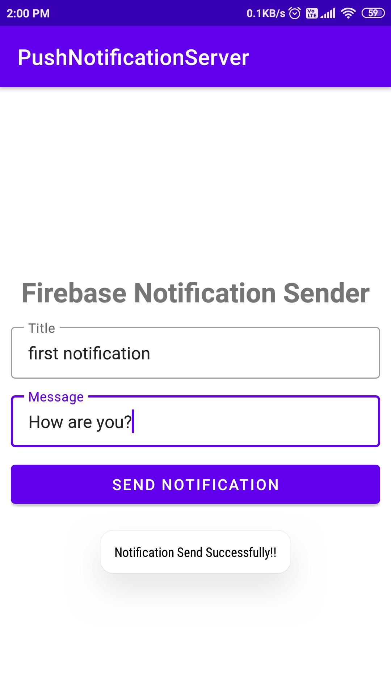
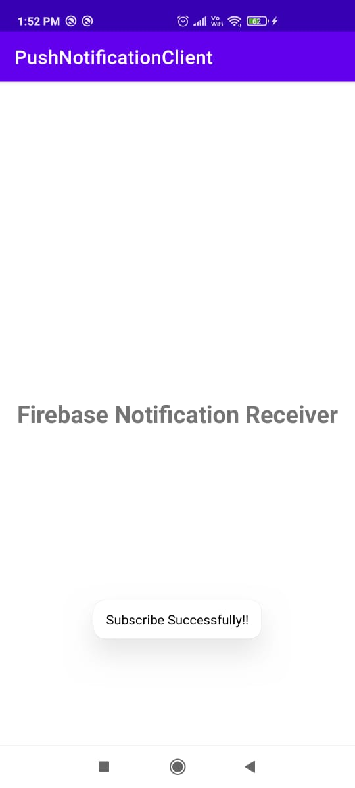
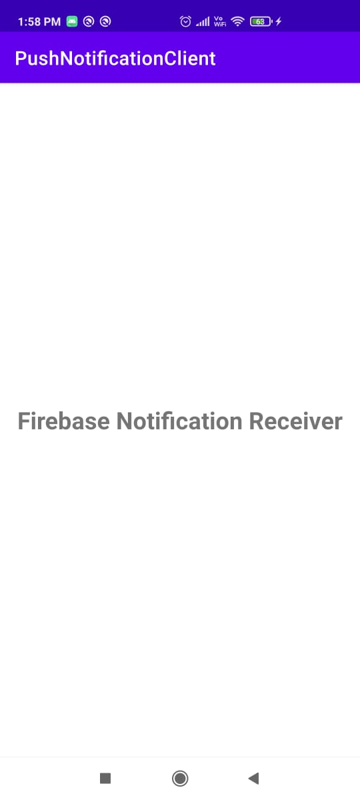
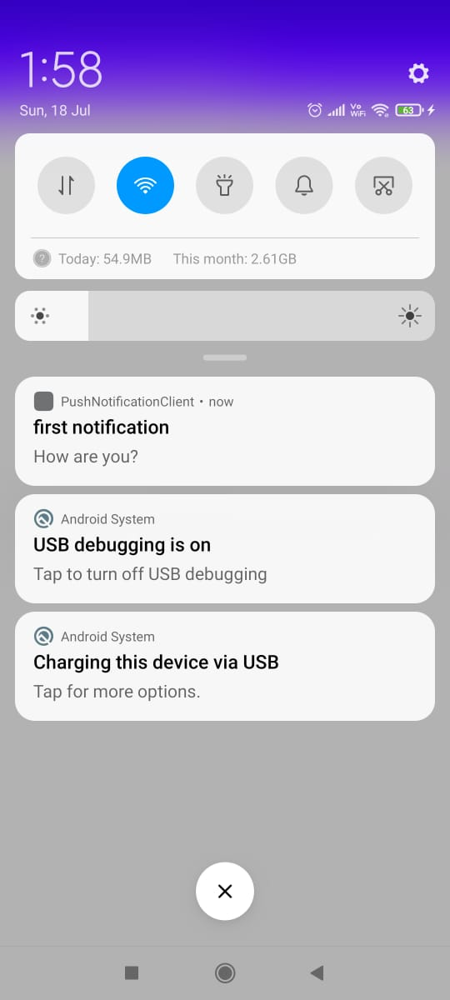

# PushNotification-Android-Android-
This is basic push notification project. In this, I send notification from one android device to another using Firebase cloud messaging. Used Volley library also. 
<b>Steps:</b> 
I) Create two android projects and one firebase project: 
  a)PushNotificationClient: 
  b)PushNotificationServer: 
  c)PushNotification (firebase project): 
 
 II) Go to firebase Console using your gmail account and click on Add Project. Give name to your project.. and create your firebase project. 
 
 III) PushNotificationClient: 
 i) Create android project, give name to project (here PushNotificationClient) and connect that project to firebase. 
 ii) To connect firebase, Open android studio -> tools -> firebase -> search Cloud messaging -> click on connect to firebase and select your project in browser. 
 iii) next step is to add cloud messaging dependancy to your project. 
 
 IV) PushNotificationServer: 
 i) Create Android Project, give name to project (here PushNotificationServer) and add Volley library in build.gradle and click on sync. 
 ii) Open your firebase project and go to project settings -> cloud messaging tab and copy firebase server key and paste it into NotificationSender.java file. 
 iii) run the both server and client application. 
 
 Screenshots: 
 i) PushNotificationServer: 
  
 
 ii) PushNotificationClient: 
 
 
 
 

